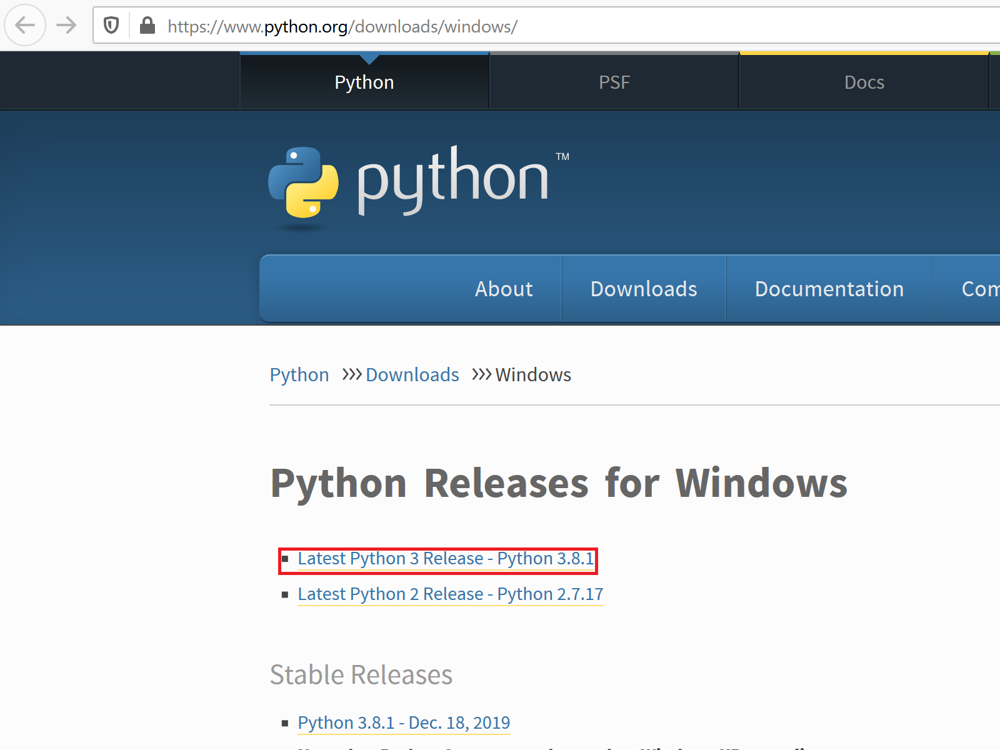
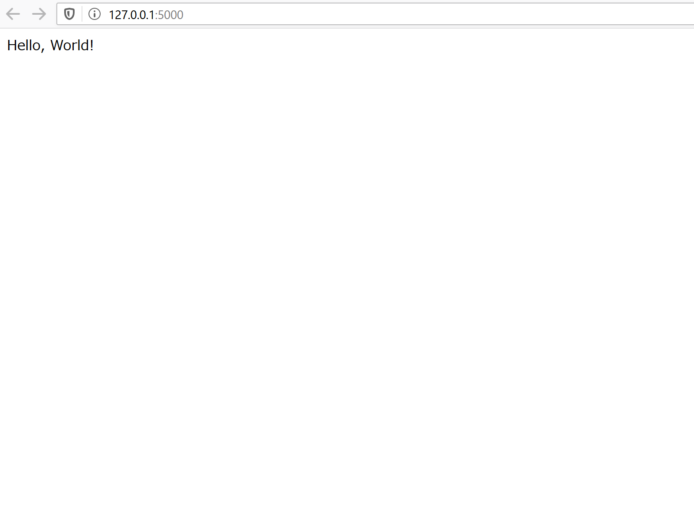

# Book-FlaskApp-01-MinimalApp

---

## Python3 のインストール

[Python Releases for Windows](https://www.python.org/downloads/windows/) の先頭に、 **Latest Python 3 Release** と書かれたリンクがあるので、リンクをクリックしてインストーラをダウンロードし、実行します。



## Flask のインストール

仮想環境を用意して、Flask パッケージを(ローカル)インストールします。

```ps
PS C:\Users\y\Documents\GitHub\Book-FlaskApp-01-MinimalApp> py -m venv flaskenv
PS C:\Users\y\Documents\GitHub\Book-FlaskApp-01-MinimalApp> flaskenv\Scripts\activate
(flaskenv) PS C:\Users\y\Documents\GitHub\Book-FlaskApp-01-MinimalApp>
```

## Flask で `Hello, World!` を返す API を作る

[app.py](app.py) を作成し、以下のコードを書きます。

```py
from flask import Flask
app = Flask(__name__)

@app.route('/')
def hello_world():
    return 'Hello, World!'
```

環境変数 `FLASK_APP` にファイル名を設定します。

```cmd
REM コマンドプロンプトの場合
C:\Users\y\Documents\GitHub\Book-FlaskApp-01-MinimalApp> set FLASK_APP=app.py
```

```ps
# PowerShellの場合
(flaskenv) PS C:\Users\y\Documents\GitHub\Book-FlaskApp-01-MinimalApp> $env:FLASK_APP = "app.py"
```

実行します。

```ps
(flaskenv) PS C:\Users\y\Documents\GitHub\Book-FlaskApp-01-MinimalApp> python -m flask run
```

> - Serving Flask app "app.py"
>
> - Environment: production
>
>   WARNING: This is a development server. Do not use it in a production deployment.
>
>   Use a production WSGI server instead.
>
> - Debug mode: off
>
> - Running on http://127.0.0.1:5000/ (Press CTRL+C to quit)

ブラウザを開き、 [http://127.0.0.1:5000/](http://127.0.0.1:5000/) にアクセスして、 `Hello, World!` と表示されることを確認します。


